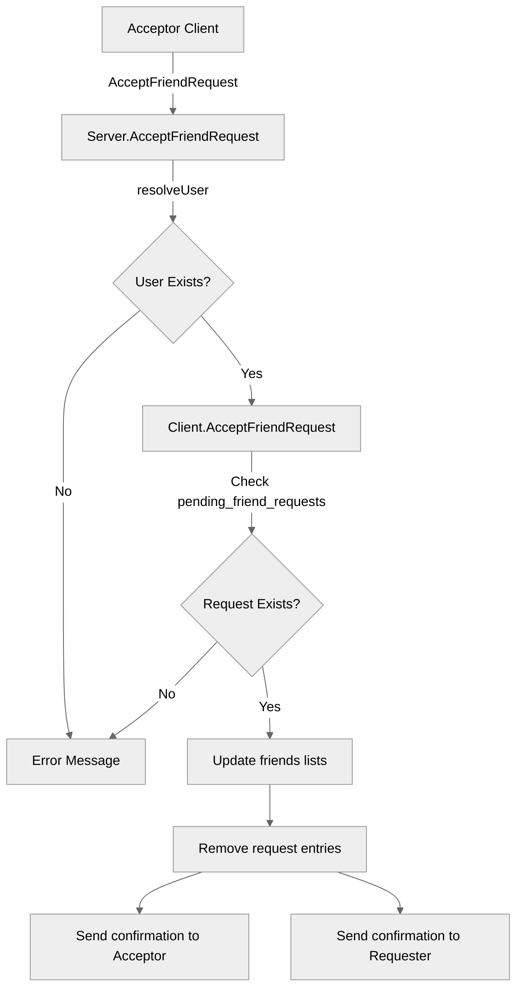

# Use case TC-02 — Accept friend request (Feature QA-03)

## Summary

The `AcceptFriendRequest` operation allows a user to accept a pending friend request from another user. Upon successful acceptance, both users are added to each other's friend lists, the pending request is removed, and confirmation messages are sent to both parties.

## Actors and stakeholders

- **Requester**: The user who sent the original friend request.
- **Acceptor**: The user who received the friend request and is now accepting it.
- **System**: The `server` and `client` implementation responsible for managing the user relationships.

## Preconditions

- The acceptor must have an active session (the `client` object exists).
- The acceptor must have received a friend request from the requester (must exist in `pending_friend_requests`).

## Data inputs and validation

- **`targetID` / `targetName`**: String identifiers for the user whose request is being accepted.
- **Validation**:
  - The system validates that the target user exists (via `server.resolveUser`).
  - The system validates that a pending friend request from the target exists (via `client.AcceptFriendRequest` checking `cl.pending_friend_requests`).
  - If validation fails, an error message is sent to the client (e.g., "You have not received a friend request from this user.").

## Main flow (user- or operator-visible)

1.  Acceptor sends an "accept friend request" command with the target's ID/name.
2.  System verifies the target user and the existence of a pending request.
3.  System updates the friend status for both users.
4.  System notifies both users that they are now friends.

## Code flow

1.  **Entry Point**: `server.AcceptFriendRequest` (in `server/server.go`) is called.
2.  **User Resolution**: `s.resolveUser(targetID, targetName)` is called to retrieve the target client.
3.  **Request Verification**: `cl.AcceptFriendRequest(target)` (in `server/client.go`) is called, which verifies the existence of the pending request in `cl.pending_friend_requests`.
4.  **Persistence/State Update**:
    - The acceptor's `friends` map is updated.
    - The requester's `friends` map is updated.
    - The acceptor's `pending_friend_requests` is updated (removed).
    - The requester's `sent_friend_request` is updated (removed).
5.  **Response**: Both clients receive a `DONE` message confirming the success of the operation.

### Mermaid

## Alternate flows

- **Target not found**: If the `targetID` or `targetName` does not map to an existing user, an error is returned.
- **Request not pending**: If the acceptor tries to accept a request that was not received, an error is returned.

## Postconditions

- Both users are friends.
- The friend request is no longer pending or sent.

## Errors and edge cases

- **"You have not received a friend request from this user."**: Occurs when the target user is not found in `pending_friend_requests`.
- **User resolution error**: If `resolveUser` fails, the client receives an error.

## Technical mapping

- `server/server.go`: Handles request routing and user resolution.
- `server/client.go`: Handles the state manipulation of friend requests and friend lists.

## Related scenarios

- TC-01: Send friend request
- TC-03: Reject friend request
- TC-05: Delete friend

## Revision

- Initial draft: data inputs, code flow, and Evidence tied to handlers and services.

## Evidence index

- `server/server.go:585-592` — `server.AcceptFriendRequest` entry point and user resolution.
- `server/client.go:115-136` — `client.AcceptFriendRequest` business logic (validation, state update, messaging).
- `server/client.go:119-122` — Validation: Check if request exists.
- `server/client.go:124-132` — Persistence: Updating friends lists and removing pending requests.
- `server/client.go:134-135` — Response: Sending messages to clients.

<!-- easyspecs-nav:children:start -->
## EasySpecs — Child documents

*None.*
<!-- easyspecs-nav:children:end -->

<!-- easyspecs-nav:parents:start -->
## EasySpecs — Parent documents

- [Friend management verification](./QA-03-friend-management-verification.md)
- [EasySpecs project](./project.md)
<!-- easyspecs-nav:parents:end -->

