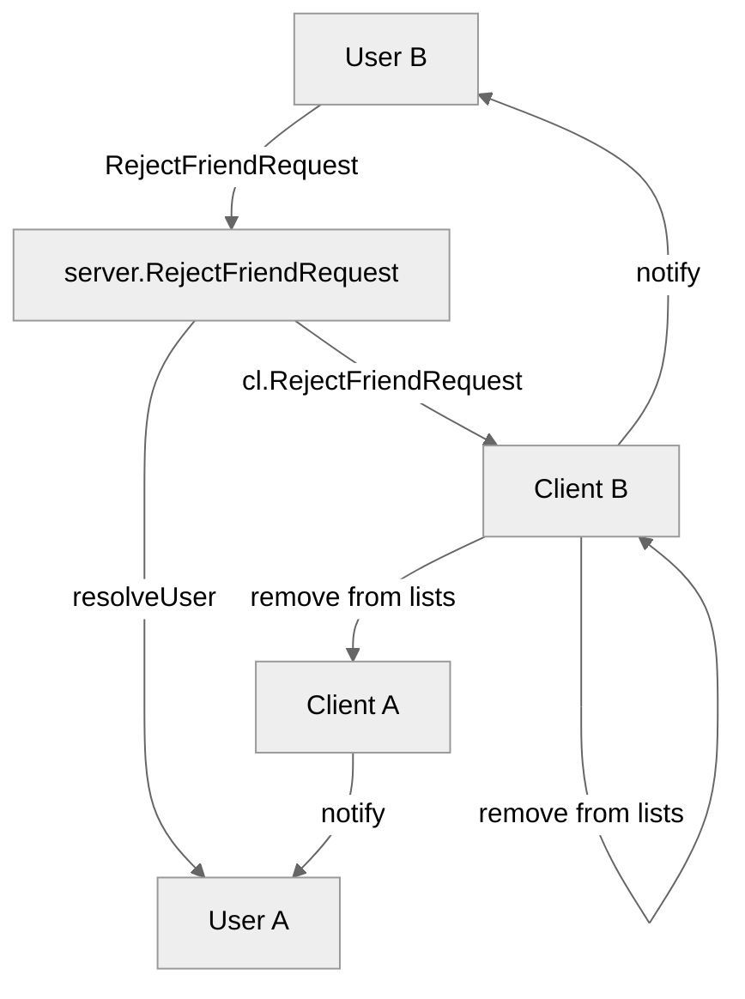

# Use case TC-03 — Reject friend request (Feature FE-03)

## Summary

A user rejects a pending friend request from another user, removing the request from both users' pending/sent request lists.

## Actors and stakeholders

- **User B (Recipient):** The user receiving the friend request, who initiates the rejection.
- **User A (Sender):** The user who sent the friend request.

## Preconditions

- User B must have a received a friend request from User A (User B must have User A's ID in their `pending_friend_requests`).
- User A must have a sent friend request to User B (User A must have User B's ID in their `sent_friend_request`).

## Data inputs and validation

- **Input:** `targetID` and `targetName` of the user whose friend request is being rejected.
- **Validation:**
    - The server resolves the target user (User A) using `s.resolveUser(targetID, targetName)` (`server/server.go:595`).
    - The client checks if the request exists in `pending_friend_requests` (`server/client.go:169`).
    - The client checks if the request exists in the sender's `sent_friend_request` (`server/client.go:177`).
- **Failure behaviour:**
    - If user not found: `cl.err` is called (`server/server.go:597`).
    - If request does not exist in `pending_friend_requests`: `cl.err` is called with "You have not received a friend request from this user." (`server/client.go:172`).
    - If record not found in sender's `sent_friend_request`: `cl.err` is called with "Error rejecting sent requests. Record not found." (`server/client.go:180`).

## Main flow (user- or operator-visible)

1. User B initiates the "Reject friend request" command, specifying User A.
2. The server verifies the existence of User A.
3. The server validates that a pending request exists from User A to User B.
4. The request is removed from both User B's pending list and User A's sent list.
5. User B receives a success message confirming rejection.
6. User A receives a notification that User B rejected their friend request.

## Code flow

### Request path (implementation)
1. `server.RejectFriendRequest` (`server/server.go:594-601`) is called with the client (User B) and the target user (User A) info.
2. `s.resolveUser` (`server/server.go:595`) is called to identify the target `*client` (User A).
3. `cl.RejectFriendRequest` (`server/client.go:167-194`) is called on User B's client object, passing User A's client object.
4. The method validates existence of the pending request in User B's `pending_friend_requests` (`server/client.go:168-170`) and sender's `sent_friend_request` (`server/client.go:176-178`).
5. Upon successful validation, the request is removed from both clients' request maps (`server/client.go:185, 189`).
6. Success/notification messages are dispatched (`server/client.go:192, 193`).

### Mermaid

## Alternate flows

- **User not found:** Request is rejected with error.
- **Request not pending:** Request is rejected with error ("You have not received a friend request from this user.").

## Postconditions

- The friend request is removed from User B's `pending_friend_requests`.
- The friend request is removed from User A's `sent_friend_request`.
- Neither user is added to the other's `friends` list.

## Errors and edge cases

- If the user does not have a pending request, the rejection fails with an error message.
- If the sender does not have a sent request in their records, it is considered an error ("Record not found").

## Technical mapping

- `server.go`: Entrypoint for the command.
- `client.go`: Logic for validating and updating friend request maps.

## Related scenarios

- None listed.

## Revision

- Initial draft: data inputs, code flow, and Evidence tied to handlers and services.

## Evidence index

- `server/server.go:594-601` — Primary entrypoint for RejectFriendRequest in server.
- `server/server.go:595` — `resolveUser` used to identify target user.
- `server/client.go:167-194` — Core business logic for `RejectFriendRequest` validation and persistence.
- `server/client.go:185, 189` — Removal of requests from pending and sent lists.
- `server/client.go:192, 193` — Success/notification message dispatch.

<!-- easyspecs-nav:children:start -->
## EasySpecs — Child documents

*None.*
<!-- easyspecs-nav:children:end -->

<!-- easyspecs-nav:parents:start -->
## EasySpecs — Parent documents

- [Friend management verification](./QA-03-friend-management-verification.md)
- [EasySpecs project](./project.md)
<!-- easyspecs-nav:parents:end -->

