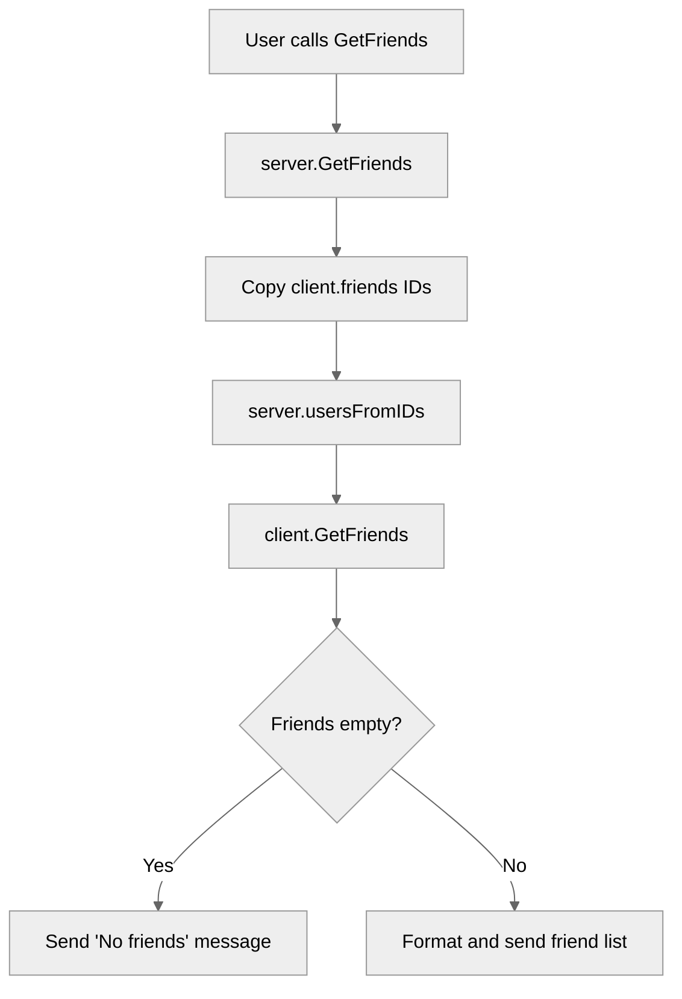

# Use case TC-04 — List friends (Feature QA-03)

## Summary

Retrieves the list of friends for the currently authenticated client and displays them in a numbered list or indicates if the user has no friends.

## Actors and stakeholders

- **Client**: The authenticated user requesting their friend list.

## Preconditions

- The client must be authenticated.

## Data inputs and validation

- **Input**: None required from the user via the `GetFriends` command. The command uses the current client's internal `friends` set.
- **Validation**: None required beyond checking for authenticated state (implicit in calling this method on an authenticated client).

## Main flow (user- or operator-visible)

1. The user requests to list their friends.
2. The system retrieves the IDs of all friends associated with the user.
3. The system fetches the corresponding user details for those IDs.
4. The system formats the list of friend nicknames and sends them to the user.

## Code flow

### Request path (implementation)

1. **Entrypoint**: The `GetFriends` method on the `server` struct is called, receiving the current `client` object (`server/server.go:626`).
2. **Retrieve Friend IDs**: The server acquires a read lock on the client's mutex, copies the set of friend IDs, and releases the lock (`server/server.go:627-629`).
3. **Fetch User Details**: The server converts the friend IDs to user details using `s.usersFromIDs(ids)` (`server/server.go:630`).
4. **Display Friends**: The server calls the client's `GetFriends` method, passing the fetched user details (`server/client.go:224`).
5. **Final Response**:
    - If the list is empty, it informs the user: "You have no friends." (`server/client.go:226`)
    - Otherwise, it formats the list using `formatNumberedList` and sends a message to the user: "these are your friends:" followed by the list (`server/client.go:230-234`).

### Mermaid

## Alternate flows

- **No friends**: If the client has an empty friend list, the system responds with "You have no friends."

## Postconditions

- None.

## Errors and edge cases

- **Not authenticated**: The client must be authenticated; otherwise, the command will not be processed correctly or may result in an error message (handled by the protocol layer).

## Technical mapping

- **`client.friends`**: A `map[string]struct{}` storing the friend IDs.
- **`server.usersFromIDs`**: A helper method on the `server` to map IDs to user objects.

## Related scenarios

- None.

## Revision

- Initial draft: data inputs, code flow, and Evidence tied to handlers and services.

## Evidence index

- `server/server.go:626-631` — Entrypoint and implementation of `GetFriends` on the server side.
- `server/client.go:224-236` — Implementation of `GetFriends` on the client side, responsible for formatting and sending the response.

<!-- easyspecs-nav:children:start -->
## EasySpecs — Child documents

*None.*
<!-- easyspecs-nav:children:end -->

<!-- easyspecs-nav:parents:start -->
## EasySpecs — Parent documents

- [Friend management verification](./QA-03-friend-management-verification.md)
- [EasySpecs project](./project.md)
<!-- easyspecs-nav:parents:end -->

