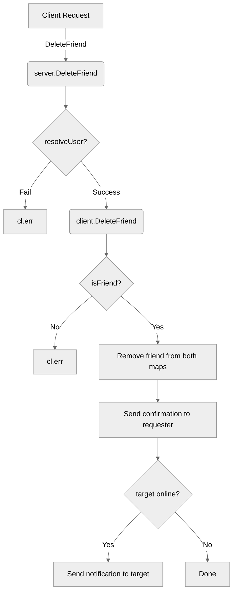

# Use case TC-05 — Delete friend (Feature QA-03)

## Summary

The `DeleteFriend` functionality allows a user to remove another user from their friends list. This action is mutual: upon successful removal, the target friend is also removed from the requester's friends list, and a notification is sent to both parties if applicable.

## Actors and stakeholders

- **Requester (`client`)**: The user initiating the deletion.
- **Target (`client`)**: The user being removed from the requester's friends list.

## Preconditions

- The requester must be authenticated.
- The requester must have an existing friendship with the target user.
- Both users should be in a valid state (friends list initialized).

## Data inputs and validation

- **`targetID`** (string): The ID of the friend to be removed.
- **`targetName`** (string): The nickname of the friend to be removed.
- **Validation**:
  - `server.DeleteFriend` validates that the user exists using `s.resolveUser`.
  - `client.DeleteFriend` validates that the requester and the target are actually friends using `hasID(cl.friends, friend.id)`.
  - Failure to find the user or verify friendship triggers a `cl.err` message and terminates the operation.

## Main flow (user- or operator-visible)

1. User initiates the delete friend request by providing the `targetID` and `targetName`.
2. The server resolves the target user.
3. The system verifies if they are friends.
4. If verified, the friendship link is removed from both sides.
5. The requester receives a confirmation message.
6. The target user receives a notification about being removed (if online).

## Code flow

1. **Entrypoint**: `server.DeleteFriend(cl, targetID, targetName)` in `server/server.go` receives the request.
2. **Resolution**: `s.resolveUser(targetID, targetName)` is called to identify the target `client`.
3. **Friendship Verification**: `cl.DeleteFriend(friend)` in `server/client.go` checks if `targetID` is in `cl.friends`.
4. **Persistence (Memory)**:
   - `delete(cl.friends, friend.id)` removes the target from the requester's friends list.
   - `delete(friend.friends, cl.id)` removes the requester from the target's friends list.
5. **Notification**: 
   - A `DONE` message is sent to the requester.
   - If the target is online, a notification message is sent to the target.

### Mermaid

## Alternate flows

- **User not found**: If the `targetID`/`targetName` does not map to an existing user, `resolveUser` returns an error, handled by `cl.err`.
- **Not friends**: If `hasID` returns false, the system sends an error "You are not friends with [nick]." and aborts.

## Postconditions

- The friendship relationship is removed from the in-memory `friends` maps of both clients.

## Errors and edge cases

- **Not Friends**: Handled in `server/client.go:242-245`.
- **User Resolution Error**: Handled in `server/server.go:635-638`.

## Technical mapping

- `server.go` acts as the controller dispatching to `client.go` methods.
- Friendship data is stored in `map[string]*client` (inferred from `cl.friends` type).

## Related scenarios

- `SC-delete-friend-success`
- `SC-delete-non-existent-friend-error`

## Revision

- Initial draft: outlined data inputs, main flow, code flow, and evidence.

## Evidence index

- `server/server.go:633-640` — Entrypoint `server.DeleteFriend` and target resolution.
- `server/client.go:238-245` — Friendship check (`hasID`) and error handling.
- `server/client.go:247-253` — Friendship removal from `friends` map.
- `server/client.go:255-262` — Response mapping and target notification.

<!-- easyspecs-nav:children:start -->
## EasySpecs — Child documents

*None.*
<!-- easyspecs-nav:children:end -->

<!-- easyspecs-nav:parents:start -->
## EasySpecs — Parent documents

- [Friend management verification](./QA-03-friend-management-verification.md)
- [EasySpecs project](./project.md)
<!-- easyspecs-nav:parents:end -->

