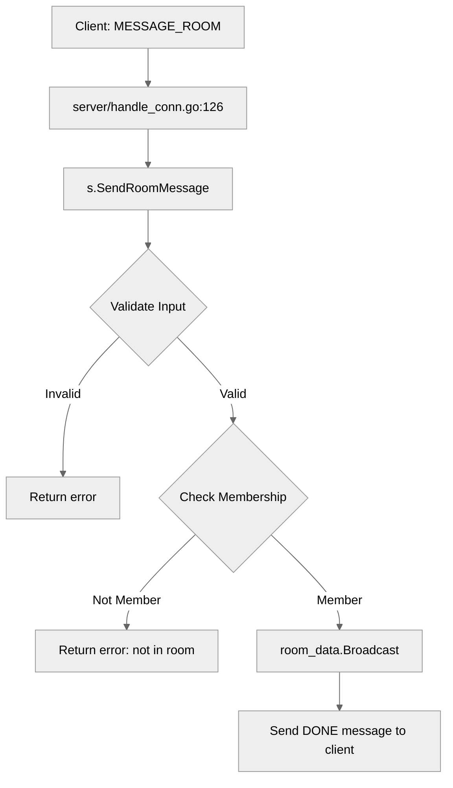

# Use case TC-02 — Send message to room successfully (Feature QA-04)

## Summary

This test case verifies that an authenticated user can successfully send a message to a room they are currently a member of.

## Actors and stakeholders

- **User**: The client initiating the action.
- **Server**: Processes the message request, verifies room membership, and broadcasts the message to the room.

## Preconditions

- The user must be authenticated.
- The user must be a member of the room they are attempting to message.

## Data inputs and validation

- **roomName** (string): Mandatory, identifies the target room.
- **message** (string): Mandatory, the content to be sent.

Validation rules:
- `message` cannot be empty (checked in `server/server.go:514-518`).
- `roomName` cannot be empty (checked in `server/server.go:519-522`).
- The user must be a member of the room; if not, an error is returned (checked in `server/server.go:524-539`).

## Main flow (user- or operator-visible)

1. The user sends a `MESSAGE_ROOM` request with `roomName` and `message`.
2. The server validates that the message is not empty.
3. The server validates that the room name is provided.
4. The server checks if the user is a member of the room.
5. If valid, the server broadcasts the message to the room.
6. The user receives a confirmation message.

## Code flow

### Request path

1. Entrypoint in `server/handle_conn.go` handles `MESSAGE_ROOM` and calls `s.SendRoomMessage(cl, p.roomName(), p.Message)`.
2. `server/server.go:513` validates inputs and checks room membership.
3. If successful, `server/server.go:541` calls `room_data.Broadcast(cl, message)`.
4. Confirmation is sent to the client in `server/server.go:542`.

### Mermaid

## Alternate flows

- **Message is empty**: Server returns "message cannot be empty" error.
- **Room name is empty**: Server returns "room name is required" error.
- **User not in room**: Server returns "you are not in room: [roomName]" error.

## Postconditions

- The message is successfully broadcast to all members of the target room.
- The sender receives a confirmation of the sent message.

## Errors and edge cases

- Handled via `cl.err(fmt.Errorf(...))` calls in `server/server.go`.

## Technical mapping

- **Room membership**: Managed via `cl.roomByName(roomName)` and checked against `cl.my_rooms`.

## Related scenarios

- None.

## Revision

- Initial draft: data inputs, code flow, and Evidence tied to handlers and services.

## Evidence index

- `server/handle_conn.go:126-127` — Entry point for `MESSAGE_ROOM` action.
- `server/server.go:513-543` — `SendRoomMessage` implementation (validation, membership check, broadcast).

<!-- easyspecs-nav:children:start -->
## EasySpecs — Child documents

*None.*
<!-- easyspecs-nav:children:end -->

<!-- easyspecs-nav:parents:start -->
## EasySpecs — Parent documents

- [Chat and context management verification](./QA-04-chat-and-context-management-verification.md)
- [EasySpecs project](./project.md)
<!-- easyspecs-nav:parents:end -->

