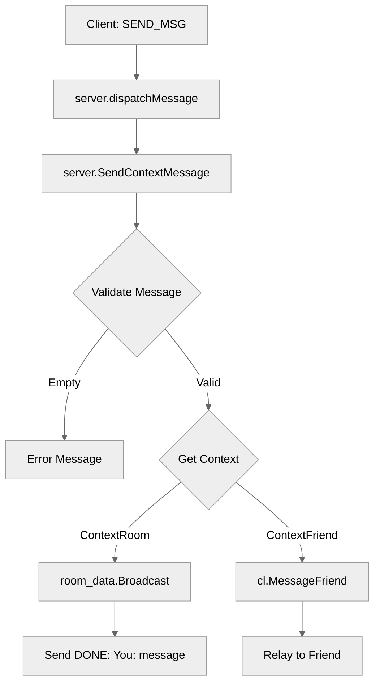

# Use case TC-03 — Send message to current context successfully (Feature QA-04)

## Summary

The user sends a message to their currently active context (either a chat room or a friend) using the `SEND_MSG` command. The server validates that a context exists and relays the message accordingly.

## Actors and stakeholders

- **User**: The client initiating the message.
- **Server**: Receives the request and performs context-specific relaying.

## Preconditions

- The client must be authenticated (logged in).
- The client must have a currently set context (`current_context` is either `contextRoom` or `contextFriend`) and the corresponding entity (`room` or `current_friend`) must be present in the client's state.

## Data inputs and validation

- **Input**: A `Message` struct with `Action: SEND_MSG` and a `Payload` containing the message string.
- **Validation**:
  - The server verifies that the message content is not empty (trims whitespace, `server/server.go:370-374`).
  - If the context is `contextRoom`, it checks that `room_data` is not nil (`server/server.go:384`).
  - If the context is `contextFriend`, it checks that `friend` is not nil (`server/server.go:392`).
  - If the context is invalid or the entity is nil, the server returns an error message to the client (`server/server.go:385`, `393`, `399`).

## Main flow (user- or operator-visible)

1. User sends `SEND_MSG` with a message.
2. Server validates message content.
3. Server identifies active context.
4. Server dispatches message to the correct target (room or friend).
5. User receives a confirmation or the message is relayed.

## Code flow

### Request path (implementation)

1. **Entrypoint**: `server/handle_conn.go:128-129` calls `s.SendContextMessage(cl, p.Message)`.
2. **Input parsing & initial validation**: `server/server.go:369-374` checks for empty message content.
3. **Context lookup**: `server/server.go:376-380` retrieves current context (`ctx`, `room_data`, `friend`) using `cl.mu.RLock()`.
4. **Relaying**:
   - If `contextRoom`: `room_data.Broadcast(cl, message)` is called (`server/server.go:388`).
   - If `contextFriend`: `cl.MessageFriend(friend, message)` is called (`server/server.go:396`).
5. **Response**: If successful for room context, `cl.send_user_message` returns a confirmation (`server/server.go:389`).

### Mermaid

## Alternate flows

- **Empty message**: Server sends error to client (`server/server.go:372`).
- **No context**: Server sends error to client (`server/server.go:399`).
- **Room/Friend nil**: Server sends error to client (`server/server.go:385`, `393`).

## Postconditions

- Message is successfully broadcasted to the room or sent to the friend.

## Errors and edge cases

- `message` is empty or only whitespace.
- `current_context` is `contextNone`.
- `room` or `current_friend` field in `client` is `nil` despite context being set.

## Technical mapping

- `client` structure (`server/handle_conn.go`) stores state of `current_context`, `room`, and `current_friend`.
- `server` structure (`server/server.go`) methods implement the dispatch and relay logic.

## Related scenarios

- None listed.

## Revision

- Initial draft: mapped flow to `server.SendContextMessage` and identified validation/dispatch points.

## Evidence index

- `server/handle_conn.go:128-129` — Entrypoint: `SEND_MSG` handler calls `SendContextMessage`.
- `server/server.go:369-374` — Validation: empty message check.
- `server/server.go:376-380` — State: retrieving client context state under lock.
- `server/server.go:382-400` — Logic: dispatching message based on context type.
- `server/server.go:389` — Response: room message confirmation.

<!-- easyspecs-nav:children:start -->
## EasySpecs — Child documents

*None.*
<!-- easyspecs-nav:children:end -->

<!-- easyspecs-nav:parents:start -->
## EasySpecs — Parent documents

- [Chat and context management verification](./QA-04-chat-and-context-management-verification.md)
- [EasySpecs project](./project.md)
<!-- easyspecs-nav:parents:end -->

