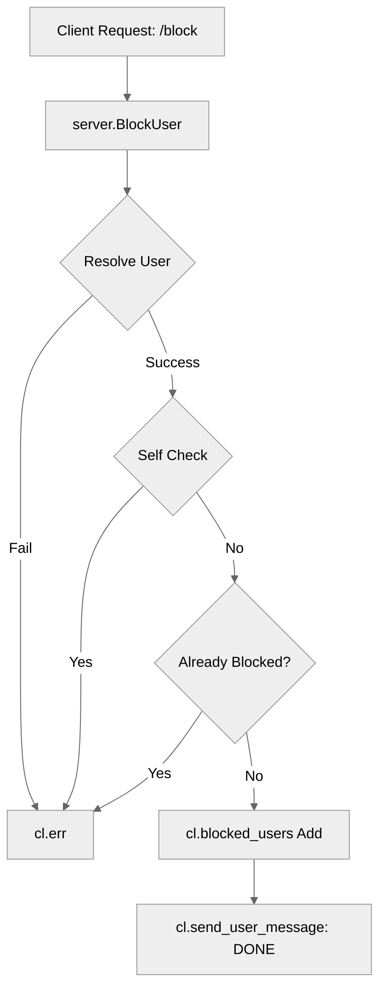

# Use case FE-05_UC-01 — Block user (Feature QA-05)

## Summary

The `BlockUser` use case allows a client to block another user. This prevents interactions (like messaging or file sharing) with the blocked user. The primary actor is the authenticated client who wishes to block another user in the system.

## Actors and stakeholders

- **Client**: The initiator of the block request.
- **Target User**: The user being blocked.

## Preconditions

- The client must be authenticated and connected to the system.
- The target user must exist in the system.

## Data inputs and validation

- **Target User**: Identified by `targetID` or `targetName`.
- **Validation Rules**:
  - The `targetID` or `targetName` must resolve to a valid existing client.
  - The client cannot block themselves (checked in `server/client.go:324-327`).
  - The user must not already be in the client's `blocked_users` list (checked in `server/client.go:330-334`).

## Main flow (user- or operator-visible)

1. The client initiates the "block user" action, providing the target user's identifier.
2. The server resolves the target user.
3. The server validates that the client is not trying to block themselves or an already blocked user.
4. The server adds the target user to the client's blocked users list.
5. The server confirms to the client that the user has been blocked.

## Code flow

### 1. Request entry
The request enters the system through `server/server.go:651-658` (`BlockUser` handler method).

### 2. Resolution and validation
The handler resolves the target user using `s.resolveUser(targetID, targetName)`. If resolution fails, an error is returned to the client.

### 3. Blocking logic
The `BlockUser` method on the `client` struct (`server/client.go:323-342`) is called:
1. Self-block check: `if cl.id == target.id`.
2. Existing block check: `if hasID(cl.blocked_users, target.id)`.
3. Blocking: The user ID is added to the `cl.blocked_users` map within a mutex lock.
4. Response: A confirmation message is sent to the client.

### 4. Mermaid Diagram

## Alternate flows

- **Target not found**: If `s.resolveUser` fails, an error is returned to the client via `cl.err`.
- **Already blocked**: If the user is already in the `blocked_users` set, an error message is returned.

## Postconditions

- The target user's ID is stored in the client's `blocked_users` set.

## Errors and edge cases

- **Self-blocking**: Explicitly forbidden.
- **Target user non-existent**: Handled during resolution.
- **Concurrent access**: Mutexes are used on `cl` and `s` structs to ensure thread safety when modifying `blocked_users` and handling client messages.

## Technical mapping

- **Storage**: `blocked_users` map in the `client` struct, which uses `struct{}` as values.
- **Synchronization**: `sync.RWMutex` used for thread-safe access to `blocked_users`.

## Related scenarios

- **SC-01**: Successfully block a user.
- **SC-02**: Attempt to block self (fail).
- **SC-03**: Attempt to block an already blocked user (fail).

## Revision

- Initial draft: Added summary, actors, preconditions, data inputs, code flow, mermaid diagram, and evidence index.

## Evidence index

- `server/server.go:651-658` — Entry point: `BlockUser` handler.
- `server/client.go:323-342` — Logic: `BlockUser` implementation in `client` struct.
- `server/client.go:324-327` — Validation: Block self check.
- `server/client.go:330-334` — Validation: Already blocked check.
- `server/client.go:337-339` — Persistence: Adding to `blocked_users` map.

<!-- easyspecs-nav:children:start -->
## EasySpecs — Child documents

*None.*
<!-- easyspecs-nav:children:end -->

<!-- easyspecs-nav:parents:start -->
## EasySpecs — Parent documents

- [User management verification](./QA-05-user-management-verification.md)
- [EasySpecs project](./project.md)
<!-- easyspecs-nav:parents:end -->

