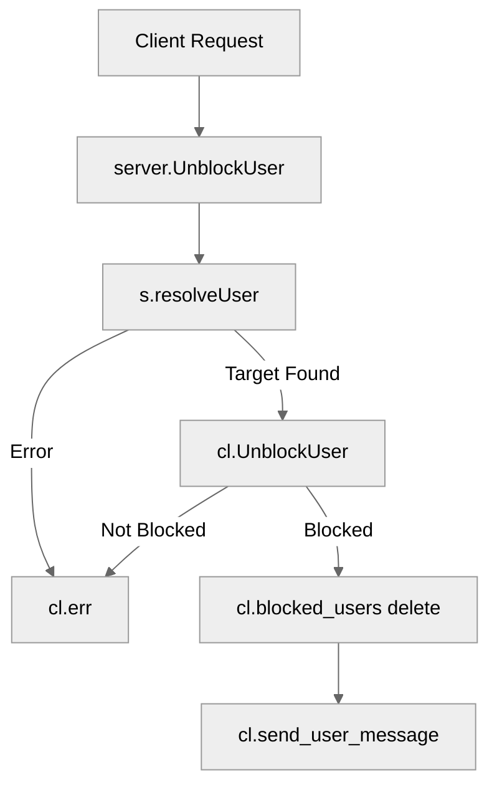

# Use case TC-02 — Unblock user (Feature QA-05)

## Summary

The actor (an authenticated user) requests to unblock a previously blocked user. The system verifies if the target user is indeed in the actor's blocked list and removes them, updating the state and notifying the actor.

## Actors and stakeholders

- **Authenticated Client:** The user performing the action.
- **Target Client:** The user to be unblocked.
- **System (Server):** Manages user state and blocks.

## Preconditions

- The actor must be authenticated.
- The target user must be currently blocked by the actor.

## Data inputs and validation

- **`targetID` / `targetName`**: Used to identify the target client.
- **Validation**: `server.resolveUser` checks if the target user exists. If not, an error is returned.
- **Business Rule**: `client.UnblockUser` checks if the target user is currently in the actor's `blocked_users` map. If not, an error is returned.

## Main flow (user- or operator-visible)

1.  Actor sends a request to unblock a user (by ID or nickname).
2.  Server resolves the target user.
3.  Server validates if the target user is blocked.
4.  Server removes the target user from the blocked list.
5.  Server sends a confirmation message to the actor.

## Code flow

### 1. Request Handling
The request enters via `server.UnblockUser`. It resolves the target user and delegates the action to the client's method.

### 2. Validation and Execution
`client.UnblockUser` validates the block status using a read lock on the `blocked_users` map. If blocked, it takes a write lock to remove the target from the map.

### 3. Mermaid Flow

## Alternate flows

- **Target not found**: `s.resolveUser` returns an error, handled by `cl.err`.
- **User not blocked**: `cl.UnblockUser` detects the target is not in `blocked_users` and returns an error.

## Postconditions

- The target user is no longer in the actor's blocked list.
- The actor receives a confirmation message.

## Errors and edge cases

- **Target not blocked**: `cl.err` is called with message "`%s is not blocked.`".
- **Target user does not exist**: `s.resolveUser` returns an error, `cl.err` is called.

## Technical mapping

- **Storage**: `blocked_users` map in the `client` struct.
- **Concurrency**: `mu` RWMutex in `client` struct to protect `blocked_users`.

## Related scenarios

- None.

## Revision

- Initial draft: Implementation-based documentation for unblocking users.

## Evidence index

- `server/server.go:660-667` — Entry point for `UnblockUser`.
- `server/client.go:344-358` — `client.UnblockUser` implementation (validation, map update, notification).
- `server/client.go:346` — Check if blocked (validation).
- `server/client.go:354` — Removal from blocked list (persistence/mutation).
- `server/client.go:357` — Success response.

<!-- easyspecs-nav:children:start -->
## EasySpecs — Child documents

*None.*
<!-- easyspecs-nav:children:end -->

<!-- easyspecs-nav:parents:start -->
## EasySpecs — Parent documents

- [User management verification](./QA-05-user-management-verification.md)
- [EasySpecs project](./project.md)
<!-- easyspecs-nav:parents:end -->

