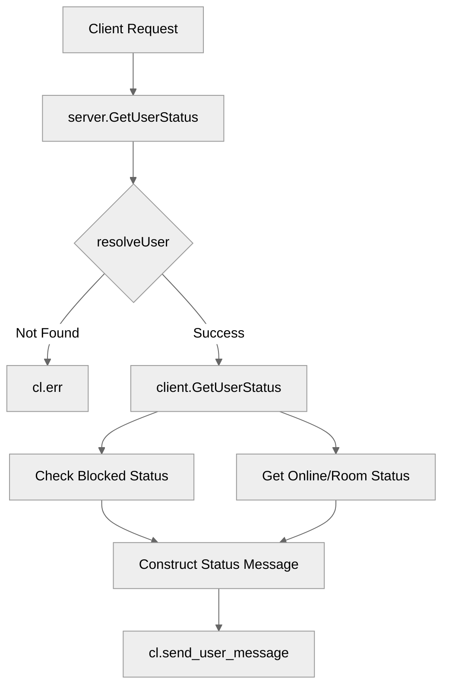

# Use case FE-05_UC-03 — Get user status (Feature QA-05)

## Summary

The Get user status use case allows a client to retrieve the status of another user (target), including their online/offline status, current room, and whether the target is blocked by the requesting client.

## Actors and stakeholders

- **Requesting Client (`*client`)**: The user requesting the status information.
- **Target User (`*client`)**: The user whose status is being queried.
- **Server (`*server`)**: The central system mediating the request and resolving the user.

## Preconditions

- The requesting client must be authenticated and connected to the server.
- The target user must be resolvable by the server (either by ID or nickname).

## Data inputs and validation

- `targetID` (string): The unique identifier of the target user (optional, used if `targetName` is not provided or to refine search).
- `targetName` (string): The nickname of the target user (optional).
- **Validation**: `server.resolveUser` is called to identify the target user. If the target cannot be found, an error is returned to the client (`cl.err(err)`).

## Main flow (user- or operator-visible)

1. The client sends a request to get the status of a user.
2. The server resolves the target user based on provided ID or nickname.
3. The server calls the client's `GetUserStatus` method, passing the target user object.
4. The system checks if the target is blocked by the requesting client.
5. The system retrieves the target's online status and current room information.
6. The system sends a response to the requesting client containing the status details.

## Code flow

### 1. Request Handling (Implementation)

1. `server.GetUserStatus` is invoked with the requesting client and target identifiers.
2. `server.resolveUser` is called to fetch the `target` client object.
3. If `resolveUser` fails, the error is sent back to the client.
4. If successful, `cl.GetUserStatus(target)` is called.

### 2. Status Retrieval (Implementation)

1. `client.GetUserStatus` is called with the target client.
2. `client.mu.RLock()` protects access to the requesting client's `blocked_users` list.
3. `hasID(cl.blocked_users, target.id)` checks if the target is blocked.
4. `target.mu.RLock()` protects access to the target client's state.
5. Target's online status (`target.online`) and current room (`target.room`) are retrieved.
6. A message is sent back to the client with the consolidated status data:
   - `user_id`, `nick`, `online`, `blocked`, `room_id`, `room`.

### Mermaid

## Alternate flows

- **Target not found**: If `server.resolveUser` returns an error, the requesting client receives an error message and the process terminates.

## Postconditions

- The requesting client receives a JSON payload with the target's status information.

## Errors and edge cases

- **Invalid target**: Handled by `server.resolveUser`.
- **Target blocked**: Correctly reported in the `blocked` field of the status response.

## Technical mapping

- `server/server.go`: Primary handler (`GetUserStatus`).
- `server/client.go`: Logic implementation (`GetUserStatus`, `hasID`).

## Related scenarios

- None listed in `QA-05-test-cases-list.json`.

## Revision

- Initial draft: data inputs, code flow, and Evidence tied to handlers and services.

## Evidence index

- `server/server.go:669-676` — entrypoint: `server.GetUserStatus` handler.
- `server/client.go:366-394` — implementation: `client.GetUserStatus` logic, blocked check, status retrieval.
- `server/server.go:670` — validation: `s.resolveUser` call.

<!-- easyspecs-nav:children:start -->
## EasySpecs — Child documents

*None.*
<!-- easyspecs-nav:children:end -->

<!-- easyspecs-nav:parents:start -->
## EasySpecs — Parent documents

- [User management verification](./QA-05-user-management-verification.md)
- [EasySpecs project](./project.md)
<!-- easyspecs-nav:parents:end -->

