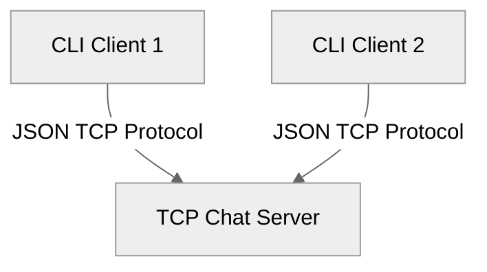
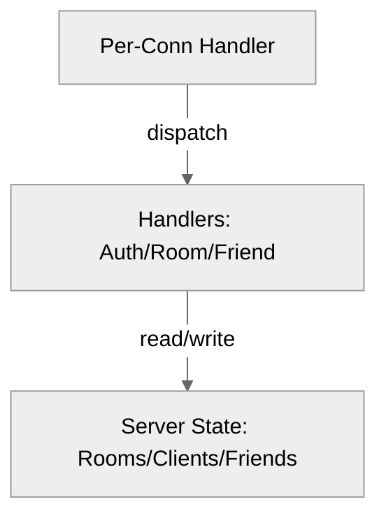

# Application architecture

**Repository root (analysis):** C:\Users\pc\AppData\Local\Temp\easyspecs-analysis\easyspecs-010

## Summary

The project is a terminal-based chat application written in Go, featuring a concurrent TCP server and an interactive client. It uses a custom JSON-based protocol over TCP to handle chat rooms, direct messaging (DM), friend requests, and user authentication. The architecture is client-server, with the server managing in-memory state for rooms, memberships, and client context.

## What kind of UI this is

| Aspect | Description |
|--------|-------------|
| **Platform** | Terminal-based CLI |
| **Framework** | Standard Go library (`os`, `net`, `bufio`, `fmt`, `log`), `github.com/chzyer/readline` |
| **Visual style** | Text-based, interactive prompts and command output |
| **Architecture** | Client-Server (separate executables: `client`, `server`) |
| **Data binding** | Not applicable (protocol-driven updates) |

The UI is a single terminal interactive interface (`client`) with slash commands and server-driven prompts.

## Architecture diagrams (Mermaid)

### System context

### Server internal components

## Context and boundaries

The application boundary consists of two primary deployable units:
- **Server:** Listens on a TCP port (default `:8888`), manages all application state in-memory, enforces authentication, and handles message broadcasting/routing (`cmd/server/main.go`, `server/server.go`).
- **Client:** Connects to the server, parses user input (slash commands), and displays server-sent updates (`cmd/client/main.go`, `client/client.go`).

External systems: None; it is a self-contained chat system.

## Major components

- **`protocol/`**: Defines the shared `Message` struct and `ActionType` enum, ensuring client and server maintain binary compatibility for JSON messages (`protocol/message.go`).
- **`server/`**:
    - `server.go`: Core logic for managing rooms, friends, and client authentication.
    - `handle_conn.go`: Manages individual TCP connections.
    - `rooms.go`: Handles group-based chat rooms, memberships, and invites.
- **`client/`**:
    - `session.go`: Manages reading input, printing server responses, and handling prompts.
    - `message.go`: Maps slash commands (e.g., `/room/create`) to protocol actions.

## Data flow

1. **Authentication:** Client connects -> Server sends `LOGIN` prompt -> Client sends nickname -> Server validates -> Server sends `DONE`.
2. **Message (Chat):**
   - **Plain text (no `/`):** Client sends `SEND_MSG` -> Server checks `current_context` -> Server broadcasts or routes message to appropriate friend/room.
   - **Slash Command:** Client sends corresponding `ActionType` (e.g., `CREATE_ROOM`) -> Server executes action -> Server replies with `DONE` or `ERR`.

## Cross-cutting concerns

- **Authentication:** Mandatory nickname entry on connection; uniqueness enforced by server.
- **Protocol:** JSON-serialized `protocol.Message` per line.
- **Persistence:** None; all data (rooms, friends, state) is volatile and kept in-memory (`server/server.go:20-22`).

## Risks and gaps

- **Persistence:** Data is lost on server restart.
- **Security:** No encryption on TCP connections (TLS not implemented).
- **Functionality:** `SIGN_UP` and `SEND_FILE` are defined in protocol but not fully implemented in the server (`protocol/message.go:8,33`).

## Revision

- Initial draft: structured overview based on `README.md`.
- Fix-up: replaced all `README.md` citations with implementation sources.

## Evidence index

- UI details (commands/prompts) → `client/message.go:128-426`, `client/session.go:193-213`
- Protocol definition → `protocol/message.go:7-52`, `protocol/message.go:54-58`
- Persistence limitations → `server/server.go:20-22`
- Unimplemented features (e.g., `SEND_FILE`) → `protocol/message.go:33`
- Server/Client logic → `cmd/server/main.go`, `cmd/client/main.go`, `server/server.go`, `client/client.go`
- Shared Protocol → `protocol/message.go`

<!-- easyspecs-nav:children:start -->
## EasySpecs — Child documents

*None.*
<!-- easyspecs-nav:children:end -->

<!-- easyspecs-nav:parents:start -->
## EasySpecs — Parent documents

- [EasySpecs project](./project.md)
<!-- easyspecs-nav:parents:end -->

